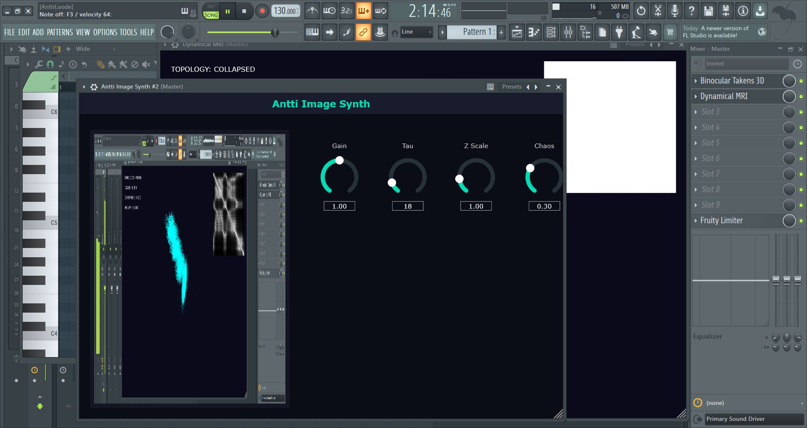

# Antti Image Synth 🎨🎹
**An Image-Driven Additive Synthesizer (VST3 / Standalone)**

 

Antti Image Synth is an experimental MIDI synthesizer that translates pictures into sound. Instead of using standard oscillators, it generates audio by continuously scanning the pixels of any image you drop into the plugin.

By analyzing the brightness and layout of the image using a continuous Lissajous pattern, it dynamically alters the harmonics and pitch of a 24-oscillator bank in real-time as you play your MIDI keyboard.

 

## ✨ Features
* **Drag-and-Drop Interface:** Instantly load any `.jpg`, `.jpeg`, `.png`, or `.bmp` file directly into the plugin window.
* **Fully Playable via MIDI:** Features full MIDI tracking and a built-in ADSR envelope so you can play your images like a traditional keyboard.
* **Lissajous Image Scanning:** The synth "reads" the image by looping through it in complex, mathematical curves.
* **24-Voice Additive Engine:** Pixel brightness directly controls the frequency shifting and harmonic balance of 24 simultaneous sine wave oscillators.

## 🎛️ The Controls
* **Gain:** Master output volume.
* **Tau:** Modifies the geometric scanning path. Turning this changes the "route" the synth takes across your image, entirely altering the rhythm and texture of the sound.
* **Z Scale:** Controls how aggressively the pixel brightness warps the pitch of the oscillators. Low values create subtle harmonic shifts; high values create wild, atonal FM-style sounds.
* **Chaos:** Introduces phase modulation and distortion. Turn it up to melt the clean sine waves into noisy, unpredictable textures.

## 🚀 How to Use It
1. Load the VST3 into your DAW (or open the Standalone app).
2. Drag and drop an image file into the central drop zone.
3. Hook up a MIDI keyboard (or use your DAW's piano roll).
4. Play some notes! Try dropping in different types of images (high-contrast black-and-white patterns vs. smooth color gradients) to hear how the visual structure changes the audio texture.

## 🛠️ How to Build (CMake)

You will need [CMake](https://cmake.org/) and a C++17 compatible compiler (Visual Studio / Xcode / GCC).

1. **Clone the repository and JUCE:**
```bash
git clone <your-repo-url> AnttiImageSynth
cd AnttiImageSynth
git clone https://github.com/juce-framework/JUCE.git
```

2. **Generate build files:**
```bash
cmake -B build
```

3. **Build the plugin:**
```bash
cmake --build build --config Release
```

4. **Locate output:**
After building, your `.vst3` and Standalone application will be found in:
```
build/AnttiImageSynth_artefacts/Release/
```

## 🧪 Built With
* JUCE Framework - Audio plugin framework
* C++17

## 📝 License
MIT License (or your chosen license)

